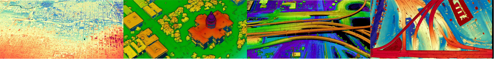

# ARPA-I INSIGHTS Dataset

A large-scale, high-density (~85 pts/m²) geiger-mode aerial LiDAR dataset covering over 1,600 km² across the Salt Lake City, UT and Denver, CO metropolitan regions.


Collected in June 2025 for a U.S. DOT ARPA-I–funded project executed by MIT Lincoln Laboratory,
the dataset is designed to support transportation digital twins: virtual inspection,
measurement, and inventory of infrastructure assets at corridor and regional scales.

Everything is public and **requires no AWS credentials** — read it anonymously over HTTPS or
with unsigned S3 requests. Dataset page:
[Registry of Open Data on AWS](https://registry.opendata.aws/arpa-i-insights/).

## Overview

- **Coverage:** 1,600+ km² across Salt Lake City and Denver
- **Point Count:** ~140 billion points in 82,429 LAS tiles
- **Resolution:** ~30 cm vertical/horizontal spacing
- **Collection Date:** June 2025
- **Format:** LAS/COPC LAZ point clouds with STAC catalog (GeoParquet index)
- **License:** CC-BY-4.0 (data), MIT (code)

## Which product do I want?

The release contains three products. They differ in coverage, label provenance, and how much
you should trust the labels.

| Product | What it is | Tiles | Best for |
|---|---|---:|---|
| **INSIGHTS-LiDAR** | The unlabeled point cloud, full coverage | 82,429 | Any geometric analysis; the canonical reference version |
| **INSIGHTS-GIS-Surface-Labels** | Surface classes derived by fusing DRCOG planimetric polygons with the point cloud | 37,495 | Weak supervision, large-area surface analysis, pretraining |
| **INSIGHTS-Manual-Semantic-Labels** | Human-annotated semantic labels, QC-stratified | 63 | Evaluation and benchmarking; small but reviewed |

Start from a **GeoParquet index** rather than listing the bucket — it carries one row per tile
with footprints, CRS, point counts, and asset URLs, so you can filter spatially or by content
before downloading anything.

## Data access

Every path below is also reachable as an S3 URI: replace
`https://arpa-i-insights.s3.us-west-2.amazonaws.com/` with `s3://arpa-i-insights/`.

### Indexes and catalogs

| Artifact | Size | Link |
|---|---:|---|
| INSIGHTS-LiDAR STAC GeoParquet index | 29 MB | [`items.parquet`](https://arpa-i-insights.s3.us-west-2.amazonaws.com/lidar/v1/stac/index/items.parquet) |
| INSIGHTS-LiDAR STAC collection | 4.7 KB | [`collection.json`](https://arpa-i-insights.s3.us-west-2.amazonaws.com/lidar/v1/stac/collection.json) |
| GIS-Surface-Labels index | 13 MB | [`gis-surface-labels-index.geoparquet`](https://arpa-i-insights.s3.us-west-2.amazonaws.com/labels/gis-surface/v1/index/gis-surface-labels-index.geoparquet) |
| Manual-Semantic-Labels index | 89 KB | [`manual-semantic-labels-index.geoparquet`](https://arpa-i-insights.s3.us-west-2.amazonaws.com/labels/manual-semantic/v1/index/manual-semantic-labels-index.geoparquet) |

### Class maps

Machine-readable class definitions. Map raw `Classification` values through these before
interpreting or combining label products.

| Artifact | Size | Link |
|---|---:|---|
| GIS-Surface-Labels class map | 3.0 KB | [`class-map.metadata.json`](https://arpa-i-insights.s3.us-west-2.amazonaws.com/labels/gis-surface/v1/metadata/class-map.metadata.json) |
| Manual-Semantic-Labels class map | 6.1 KB | [`class-map.metadata.json`](https://arpa-i-insights.s3.us-west-2.amazonaws.com/labels/manual-semantic/v1/metadata/class-map.metadata.json) |
| JSON Schema validating both (canonical) | 8.8 KB | [`class-map.schema.json`](https://arpa-i-insights.s3.us-west-2.amazonaws.com/labels/schemas/class-map.schema.json) |

One schema covers both products. It lives at `labels/schemas/class-map.schema.json` — the
`$id` the class maps declare — with identical mirrors beside each class map.

### Manual-Semantic-Labels bulk download and QC

| Artifact | Size | Link |
|---|---:|---|
| All 63 released tiles, single archive | 530 MB | [`qc-splits-final.zip`](https://arpa-i-insights.s3.us-west-2.amazonaws.com/labels/manual-semantic/v1/data/qc-splits-final.zip) |
| QC record for all 106 reviewed tiles | 61 KB | [`manual_semantic_labels_qc.jsonl`](https://arpa-i-insights.s3.us-west-2.amazonaws.com/labels/manual-semantic/v1/metadata/manual_semantic_labels_qc.jsonl) |

S3 serves HTTP range requests on the archive, so a single member can be extracted without
downloading all 530 MB.

## Dataset Structure

```text
s3://arpa-i-insights/
├── lidar/v1/
│   ├── data/<sortie>/...
│   │   ├── tile-level COPC LAZ files        # canonical INSIGHTS-LiDAR access path
│   │   ├── tile-level LAS files             # provenance and legacy-tool compatibility
│   │   └── L3_unified_copc/<sortie>.copc.laz
│   └── stac/
│       ├── collection.json
│       ├── items/<sortie>/...
│       └── index/items.parquet              # STAC GeoParquet index
├── labels/
│   ├── schemas/
│   │   └── class-map.schema.json                      # canonical, validates both class maps
│   ├── gis-surface/v1/
│   │   ├── index/gis-surface-labels-index.geoparquet
│   │   ├── data/<sortie>/...                          # per-tile COPC LAZ
│   │   └── metadata/
│   │       ├── class-map.metadata.json                # authoritative class definitions
│   │       └── class-map.schema.json                  # mirror of labels/schemas/
│   └── manual-semantic/v1/
│       ├── index/manual-semantic-labels-index.geoparquet   # per-tile index, QC + class counts
│       ├── data/
│       │   ├── qc-splits-final/tier_{0,1,2}/...            # per-tile COPC LAZ
│       │   └── qc-splits-final.zip                         # same 63 tiles, bulk download
│       └── metadata/
│           ├── class-map.metadata.json                     # authoritative class definitions
│           ├── class-map.schema.json                       # mirror of labels/schemas/
│           └── manual_semantic_labels_qc.jsonl             # QC record for all 106 reviewed tiles
```

## Quick Start

Load the LiDAR index and plot the dataset's spatial extent (requires `geopandas` and
`pyarrow`; `contextily` is optional, for the basemap only).

```python
from io import BytesIO

import boto3
# Optional contextily for basemap visualization
import contextily as ctx
import geopandas as gpd
from botocore import UNSIGNED
from botocore.config import Config

bucket = "arpa-i-insights"
s3 = boto3.client('s3', config=Config(signature_version=UNSIGNED))
STAC_INDEX_URL = "lidar/v1/stac/index/items.parquet"

# Load STAC catalog
stac_gdf = gpd.read_parquet(BytesIO(s3.get_object(Bucket=bucket, Key=STAC_INDEX_URL)["Body"].read()))
print(f"Available tiles: {len(stac_gdf):,}")
print(stac_gdf.head())

# Plot spatial extent of dataset
ax = stac_gdf.plot(figsize=(10,10))
# optionally add basemap
ctx.add_basemap(ax, crs=stac_gdf.crs)
ax.set_title("ARPA-I INSIGHTS Spatial Coverage")
```

For a guided tour of all three products, see
[`examples/get-to-know-ARPA-I-INSIGHTS.ipynb`](examples/get-to-know-ARPA-I-INSIGHTS.ipynb).

### Browse a whole sortie in your browser

Each sortie is also published as a single unified COPC, best suited to interactive
visualization rather than scripted analysis.

<details>
<summary>Unified COPC LAZ downloads and web viewers (17 sorties)</summary>

| Sortie | Unified COPC LAZ | Web view |
|---|---|---|
| DRCOG | [DRCOG.copc.laz](https://arpa-i-insights.s3.us-west-2.amazonaws.com/lidar/v1/data/DRCOG/Dissemination/L3_unified_copc/DRCOG.copc.laz) | [DRCOG unified COPC web view](https://eptium.com/?copc=https%3A%2F%2Farpa-i-insights.s3.us-west-2.amazonaws.com%2Flidar%2Fv1%2Fdata%2FDRCOG%2FDissemination%2FL3_unified_copc%2FDRCOG.copc.laz) |
| FrontRange | [FrontRange.copc.laz](https://arpa-i-insights.s3.us-west-2.amazonaws.com/lidar/v1/data/FrontRange/Dissemination/L3_unified_copc/FrontRange.copc.laz) | [FrontRange unified COPC web view](https://eptium.com/?copc=https%3A%2F%2Farpa-i-insights.s3.us-west-2.amazonaws.com%2Flidar%2Fv1%2Fdata%2FFrontRange%2FDissemination%2FL3_unified_copc%2FFrontRange.copc.laz) |
| I15South | [I15South.copc.laz](https://arpa-i-insights.s3.us-west-2.amazonaws.com/lidar/v1/data/I15South/Dissemination/L3_unified_copc/I15South.copc.laz) | [I15South unified COPC web view](https://eptium.com/?copc=https%3A%2F%2Farpa-i-insights.s3.us-west-2.amazonaws.com%2Flidar%2Fv1%2Fdata%2FI15South%2FDissemination%2FL3_unified_copc%2FI15South.copc.laz) |
| I25N | [I25N.copc.laz](https://arpa-i-insights.s3.us-west-2.amazonaws.com/lidar/v1/data/I25N/Dissemination/L3_unified_copc/I25N.copc.laz) | [I25N unified COPC web view](https://eptium.com/?copc=https%3A%2F%2Farpa-i-insights.s3.us-west-2.amazonaws.com%2Flidar%2Fv1%2Fdata%2FI25N%2FDissemination%2FL3_unified_copc%2FI25N.copc.laz) |
| I25S2 | [I25S2.copc.laz](https://arpa-i-insights.s3.us-west-2.amazonaws.com/lidar/v1/data/I25S2/Dissemination/L3_unified_copc/I25S2.copc.laz) | [I25S2 unified COPC web view](https://eptium.com/?copc=https%3A%2F%2Farpa-i-insights.s3.us-west-2.amazonaws.com%2Flidar%2Fv1%2Fdata%2FI25S2%2FDissemination%2FL3_unified_copc%2FI25S2.copc.laz) |
| I70A | [I70A.copc.laz](https://arpa-i-insights.s3.us-west-2.amazonaws.com/lidar/v1/data/I70A/Dissemination/L3_unified_copc/I70A.copc.laz) | [I70A unified COPC web view](https://eptium.com/?copc=https%3A%2F%2Farpa-i-insights.s3.us-west-2.amazonaws.com%2Flidar%2Fv1%2Fdata%2FI70A%2FDissemination%2FL3_unified_copc%2FI70A.copc.laz) |
| I70BC | [I70BC.copc.laz](https://arpa-i-insights.s3.us-west-2.amazonaws.com/lidar/v1/data/I70BC/Dissemination/L3_unified_copc/I70BC.copc.laz) | [I70BC unified COPC web view](https://eptium.com/?copc=https%3A%2F%2Farpa-i-insights.s3.us-west-2.amazonaws.com%2Flidar%2Fv1%2Fdata%2FI70BC%2FDissemination%2FL3_unified_copc%2FI70BC.copc.laz) |
| I70D | [I70D.copc.laz](https://arpa-i-insights.s3.us-west-2.amazonaws.com/lidar/v1/data/I70D/Dissemination/L3_unified_copc/I70D.copc.laz) | [I70D unified COPC web view](https://eptium.com/?copc=https%3A%2F%2Farpa-i-insights.s3.us-west-2.amazonaws.com%2Flidar%2Fv1%2Fdata%2FI70D%2FDissemination%2FL3_unified_copc%2FI70D.copc.laz) |
| I70E | [I70E.copc.laz](https://arpa-i-insights.s3.us-west-2.amazonaws.com/lidar/v1/data/I70E/Dissemination/L3_unified_copc/I70E.copc.laz) | [I70E unified COPC web view](https://eptium.com/?copc=https%3A%2F%2Farpa-i-insights.s3.us-west-2.amazonaws.com%2Flidar%2Fv1%2Fdata%2FI70E%2FDissemination%2FL3_unified_copc%2FI70E.copc.laz) |
| I70F | [I70F.copc.laz](https://arpa-i-insights.s3.us-west-2.amazonaws.com/lidar/v1/data/I70F/Dissemination/L3_unified_copc/I70F.copc.laz) | [I70F unified COPC web view](https://eptium.com/?copc=https%3A%2F%2Farpa-i-insights.s3.us-west-2.amazonaws.com%2Flidar%2Fv1%2Fdata%2FI70F%2FDissemination%2FL3_unified_copc%2FI70F.copc.laz) |
| I70G | [I70G.copc.laz](https://arpa-i-insights.s3.us-west-2.amazonaws.com/lidar/v1/data/I70G/Dissemination/L3_unified_copc/I70G.copc.laz) | [I70G unified COPC web view](https://eptium.com/?copc=https%3A%2F%2Farpa-i-insights.s3.us-west-2.amazonaws.com%2Flidar%2Fv1%2Fdata%2FI70G%2FDissemination%2FL3_unified_copc%2FI70G.copc.laz) |
| I70H | [I70H.copc.laz](https://arpa-i-insights.s3.us-west-2.amazonaws.com/lidar/v1/data/I70H/Dissemination/L3_unified_copc/I70H.copc.laz) | [I70H unified COPC web view](https://eptium.com/?copc=https%3A%2F%2Farpa-i-insights.s3.us-west-2.amazonaws.com%2Flidar%2Fv1%2Fdata%2FI70H%2FDissemination%2FL3_unified_copc%2FI70H.copc.laz) |
| I70I | [I70I.copc.laz](https://arpa-i-insights.s3.us-west-2.amazonaws.com/lidar/v1/data/I70I/Dissemination/L3_unified_copc/I70I.copc.laz) | [I70I unified COPC web view](https://eptium.com/?copc=https%3A%2F%2Farpa-i-insights.s3.us-west-2.amazonaws.com%2Flidar%2Fv1%2Fdata%2FI70I%2FDissemination%2FL3_unified_copc%2FI70I.copc.laz) |
| I80East | [I80East.copc.laz](https://arpa-i-insights.s3.us-west-2.amazonaws.com/lidar/v1/data/I80East/Dissemination/L3_unified_copc/I80East.copc.laz) | [I80East unified COPC web view](https://eptium.com/?copc=https%3A%2F%2Farpa-i-insights.s3.us-west-2.amazonaws.com%2Flidar%2Fv1%2Fdata%2FI80East%2FDissemination%2FL3_unified_copc%2FI80East.copc.laz) |
| I80P1 | [I80P1.copc.laz](https://arpa-i-insights.s3.us-west-2.amazonaws.com/lidar/v1/data/I80P1/Dissemination/L3_unified_copc/I80P1.copc.laz) | [I80P1 unified COPC web view](https://eptium.com/?copc=https%3A%2F%2Farpa-i-insights.s3.us-west-2.amazonaws.com%2Flidar%2Fv1%2Fdata%2FI80P1%2FDissemination%2FL3_unified_copc%2FI80P1.copc.laz) |
| I80P2 | [I80P2.copc.laz](https://arpa-i-insights.s3.us-west-2.amazonaws.com/lidar/v1/data/I80P2/Dissemination/L3_unified_copc/I80P2.copc.laz) | [I80P2 unified COPC web view](https://eptium.com/?copc=https%3A%2F%2Farpa-i-insights.s3.us-west-2.amazonaws.com%2Flidar%2Fv1%2Fdata%2FI80P2%2FDissemination%2FL3_unified_copc%2FI80P2.copc.laz) |
| SLC | [SLC.copc.laz](https://arpa-i-insights.s3.us-west-2.amazonaws.com/lidar/v1/data/SLC/Dissemination/L3_unified_copc/SLC.copc.laz) | [SLC unified COPC web view](https://eptium.com/?copc=https%3A%2F%2Farpa-i-insights.s3.us-west-2.amazonaws.com%2Flidar%2Fv1%2Fdata%2FSLC%2FDissemination%2FL3_unified_copc%2FSLC.copc.laz) |

</details>

## Label Products

Two label products are published alongside the LiDAR. **Their `Classification` codes are
product-specific and are not interchangeable** — code `64` is a sidewalk in GIS-Surface-Labels
but a traffic signal in Manual-Semantic-Labels. Always map codes through the relevant
product's class map before combining them.

### INSIGHTS-GIS-Surface-Labels

Surface labels derived by fusing 2024 DRCOG planimetric polygons with the point cloud,
available for the DRCOG and I25S2 sorties (37,495 tiles). Tiles are georeferenced COPC LAZ
(LAS 1.4, point data record format 7).

| Code | Class | Code source |
|---:|---|---|
| 1 | `Unclassified` (background, non-surface) | ASPRS |
| 2 | `Other Surface` | ASPRS |
| 11 | `Road` | ASPRS |
| 64 | `Sidewalk` | user-defined |
| 65 | `Driveway` | user-defined |

Class `0` is not used — every point carries a class, so `1` is this product's background
value. Authoritative definitions:
[`class-map.metadata.json`](https://arpa-i-insights.s3.us-west-2.amazonaws.com/labels/gis-surface/v1/metadata/class-map.metadata.json).

### INSIGHTS-Manual-Semantic-Labels

Human-annotated semantic segmentation labels covering transportation surfaces *and* roadside
infrastructure. 63 tiles are released (1.44 km², 16.3 M labeled points of 119.9 M total).

Class codes are ASPRS-compatible: classes with an ASPRS equivalent reuse the standard code,
and the rest occupy the LAS user-defined range (64–255).
[`class-map.metadata.json`](https://arpa-i-insights.s3.us-west-2.amazonaws.com/labels/manual-semantic/v1/metadata/class-map.metadata.json)
is the authoritative definition.

| Code | Class | Code source | Released points |
|---:|---|---|---:|
| 0 | `Unclassified` (background) | ASPRS | 103,536,485 |
| 10 | `Surface/Vehicular/Rail` | ASPRS | 154,964 |
| 11 | `Surface/Vehicular/Road` | ASPRS | 8,024,455 |
| 14 | `Infrastructure/Power Line` | ASPRS | 231,663 |
| 17 | `Surface/Vehicular/Bridge` | ASPRS | 42,327 |
| 64 | `Infrastructure/Traffic Signal` | user-defined | 10,750 |
| 65 | `Infrastructure/Light Pole` | user-defined | 13,189 |
| 66 | `Infrastructure/Utility Box` | user-defined | 5,393 |
| 67 | `Infrastructure/Misc` | user-defined | 35,211 |
| 68 | `Infrastructure/Barrier/Guardrail` | user-defined | 118,039 |
| 69 | `Infrastructure/Barrier/Misc` | user-defined | 280,770 |
| 70 | `Surface/Pedestrian/Trail` | user-defined | 286,940 |
| 71 | `Surface/Pedestrian/Sidewalk` | user-defined | 1,311,858 |
| 72 | `Surface/Vehicular/Driveway` | user-defined | 929,205 |
| 73 | `Surface/Vehicular/Misc` | user-defined | 4,891,719 |

Per-tile counts for every class are columns in the label index (`count:<class name>`), so
tiles can be selected by class content without downloading any point clouds.

Labels are released **QC-stratified rather than as a train/validation/test split**, because
cuboid-based annotation produces spatially structured errors. Report primary metrics on
Tier 1 alone; use Tier 0 to measure false positives; keep Tier 2 results separate.

| Tier | Status | Tiles | Released | Use |
|---:|---|---:|---|---|
| 0 | `confirmed_empty` | 8 | yes | Negative controls |
| 1 | `curated_evaluation` | 31 | yes | Primary evaluation (est. ≥90% precision/recall) |
| 2 | `auxiliary_with_caveats` | 24 | yes | Training, noisy-label studies (est. ≥75%) |
| 3 | `withheld_major_rework_required` | 36 | no | — |
| 4 | `withheld_unannotated_or_unusable` | 7 | no | — |

[`manual_semantic_labels_qc.jsonl`](https://arpa-i-insights.s3.us-west-2.amazonaws.com/labels/manual-semantic/v1/metadata/manual_semantic_labels_qc.jsonl)
records all 106 reviewed tiles, including the withheld ones, with structured per-class issue
fields. Those fields are **non-exhaustive**: a blank field means "not noted during QC", not
"verified absent".

> **These tiles are normalized, not georeferenced.** Each is centered on its own footprint
> and scaled so its longest axis spans 100 units, so the files carry no CRS, and intensity,
> GPS time, and return numbers are zeroed. The transform inverts exactly from the `norm:*`
> columns of the label index; use
> [`examples/scripts/georeference_manual_labels.py`](examples/scripts/georeference_manual_labels.py)
> to restore projected coordinates, and the index's `source_lidar_https_path` to recover the
> zeroed dimensions.

## Usage Examples

- **Notebook:** See [`examples/get-to-know-ARPA-I-INSIGHTS.ipynb`](examples/get-to-know-ARPA-I-INSIGHTS.ipynb) for a guided tour of all three products
- **Analysis Script:** See [`examples/scripts/analyze_las.py`](examples/scripts/analyze_las.py) for ground classification and DEM generation
- **Georeferencing Script:** See [`examples/scripts/georeference_manual_labels.py`](examples/scripts/georeference_manual_labels.py) to restore projected coordinates to manual-semantic label tiles

## Tools & Libraries

- **Point Cloud:** laspy, PDAL, CloudCompare
- **Spatial Data:** geopandas, pyarrow
- **Cloud Access:** boto3

## Sponsors & Maintainers

- **Sponsor:** U.S. Department of Transportation ARPA-I
- **Maintainer:** MIT Lincoln Laboratory

## Citation

```
ARPA-I INSIGHTS LiDAR Dataset (2026). MIT Lincoln Laboratory.
U.S. Department of Transportation ARPA-I.
Available at: https://registry.opendata.aws/arpa-i-insights/
```
